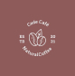

  

<h1 align='center'> Code Café - Coffe Shop </h1>

	
	
	

_Para a versão em Português, clique [aqui](#portuguese)._ 

### Topics

- [Project description](#project-description)

- [Technologies used](#technologies-used)

- [What I learned](#what-I-learned)

- [Access the Project](#access-the-project)

## Project description

This is a landing page for a fictitious coffe shop. This project was created during the frontend development course [DevQuest](https://devemdobro.com/lista/) in the beginner HTML and CSS module.

## Technologies used

  
  

## What I learned

- How to create a favicon using an image;
- Creating responsive layouts to different sizes of screens.

## Access the Project

You can [access the project here](https://caroline-barbosa-vilar.github.io/coffe-shop/) 

Mobile

Desktop 

Tablet

<h1 align='center'> Code Café - Coffe Shop </h1>

	
	
	

### Tópicos 

- [Descrição do projeto](#descrição-do-projeto)

- [Tecnologias utilizadas](#tecnologias-utilizadas)

- [O que aprendi](#o-que-aprendi)

- [Acesse o projeto](#acesse-o-projeto)

## Descrição do projeto 

Essa é uma landing page de uma cafeteria fictícia. Esse projeto foi criado durante o curso de desenvolvimento frontend [DevQuest](https://devemdobro.com/lista/) no módulo iniciante de HTML e CSS.

## Tecnologias utilizadas

  
  

## O que aprendi

- Como criar um favicon usando uma imagem;
- Criar um layout responsivo para diferentes formatos de tela.

## Acesse o projeto

Você pode [acessar o projeto aqui](https://caroline-barbosa-vilar.github.io/coffe-shop/) 

Mobile

Desktop 

Tablet

Developed with 🧡 by [me](https://www.linkedin.com/in/carolinebarbosavilar/)!

